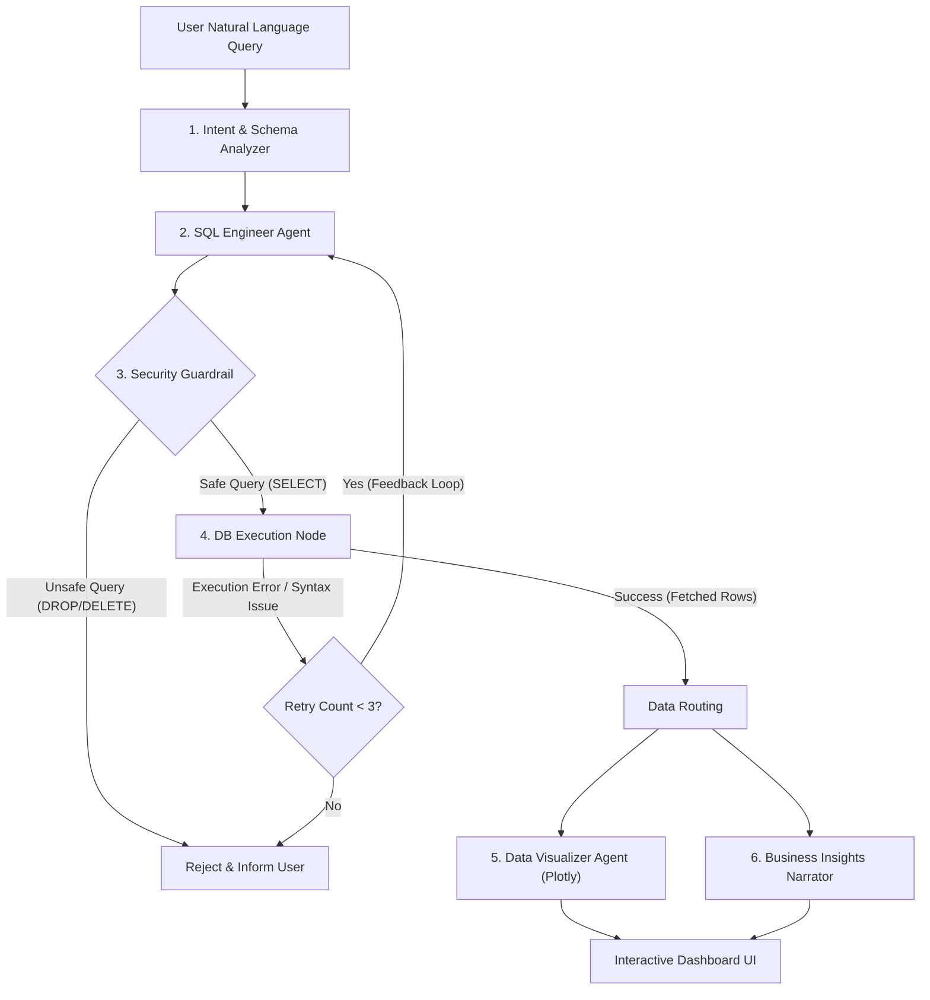

# Implementation Plan: NexusBI — Autonomous Multi-Agent BI & Conversational Analytics Engine

NexusBI is an enterprise-grade, 100% free-tier, cloud-deployable **Multi-Agent Business Intelligence (BI) Analyst**. It evolves the original notebook's single-agent script into a production-ready, autonomous data analytics application tailored for hackathon victory.

---

## 1. Why & How: Core Architectural Decisions

| Component | What We Are Using | Why We Chose It | How It Works |
| :--- | :--- | :--- | :--- |
| **Agentic Framework** | **LangGraph** (StateGraph Engine) | The notebook's `initialize_agent(zero-shot-react)` is deprecated and fragile. LangGraph provides deterministic state management, explicit error-recovery cycles (self-healing), and clear multi-agent nodes. | The state machine moves between nodes: `Planner` $\to$ `SQL Generator` $\to$ `Safety Validator` $\to$ `DB Executor` (with retry loop) $\to$ `Chartist` $\to$ `Insights Narrator`. |
| **LLM Model (100% Free)** | **Groq Cloud (`llama-3.3-70b-versatile`)** with **Google Gemini (`gemini-1.5-flash`)** fallback | OpenAI requires paid API credits ($5+). Groq provides free, ultra-fast inference (500+ tokens/sec) for Llama 3.3 70B, which matches GPT-4 in SQL accuracy. Gemini AI Studio provides a free 15 RPM tier. | User can enter their free Groq/Gemini key in the UI sidebar or set it in `.env`. Agents use LangChain unified chat wrappers (`ChatGroq` / `ChatGoogleGenerativeAI`). |
| **Database Layer** | **SQLite (`nexus_data.db`) + Pandas Ingestion** | Zero cloud cost, lightweight, embedded, portable on Streamlit Cloud without complex DB credentials. | Dynamic CSV/Excel ingestion detects datatypes, standardizes dates into ISO `YYYY-MM-DD` (fixing the notebook's month alphabetical sorting bug), and creates tables on the fly. |
| **Security / Guardrails** | **AST / Regex SQL Guard Node** | Critical for enterprise & hackathon evaluation: prevents destructive commands (`DROP`, `DELETE`, `UPDATE`, `ALTER`, `TRUNCATE`). | Intercepts SQL before DB execution. Rejects non-`SELECT` queries instantly without touching the database. |
| **Visualization** | **Plotly Express** | Raw SQL rows are hard to read. Executive dashboards need interactive, zoomable, mobile-responsive charts. | Visualizer Agent writes executable Plotly code based on column metadata (e.g. line chart for trends, bar chart for categories). |
| **User Interface** | **Streamlit** (Custom Modern Theme) | Fast, responsive, natively supports streaming, session states, file uploads, and Plotly charts. | Live agent thought streaming (`st.status`), SQL code diffs, raw table view, and executive summary tabs. |
| **Hosting & Deploy** | **Streamlit Community Cloud + GitHub** | 100% free, automated CI/CD directly from GitHub repo, permanent public `.streamlit.app` link. | Pushing commits to GitHub automatically updates the live public deployment. |

---

## 2. Multi-Agent Workflow & State Architecture



---

## 3. Project Structure

We will organize the repository with clean, modular Python architecture:

```
c:\codeneeti\
│
├── .env.example                 # Template for API keys (GROQ_API_KEY, GEMINI_API_KEY)
├── .gitignore                   # Ignore .env, __pycache__, *.db, temp files
├── README.md                    # Professional Hackathon presentation & documentation
├── requirements.txt             # Pinned, conflict-free dependencies
├── IMPLEMENTATION_PLAN.md       # Full architecture & implementation guide
│
├── data/
│   └── Sales_Agent.csv          # Bundled sample dataset from the PDF (instant demo ready)
│
├── core/
│   ├── __init__.py
│   ├── database.py              # SQLite connection, dynamic CSV/Excel to SQL loader, schema inspector
│   ├── models.py                # Pydantic schemas and Agent State definition
│   ├── security.py              # SQL Guardrail validator (read-only verification)
│   ├── llm_factory.py           # Free LLM provider router (Groq / Gemini / OpenAI fallback)
│   └── agent_graph.py           # LangGraph StateGraph implementation (Nodes, Edges, Self-Healing)
│
└── app.py                       # Streamlit UI with Glassmorphic styling, thought tracing, and charts
```

---

## 4. Proposed Implementation Steps

### Phase 1: Foundation & Data Ingestion (`core/database.py`, `data/Sales_Agent.csv`)
- Create bundled `Sales_Agent.csv` containing the exact 7 months of data from the PDF (Jan-Jul 2024: month, year, sales, expenses, profit, customer_satisfaction).
- Build `DatabaseManager` in `core/database.py`:
  - Automatically loads `Sales_Agent.csv` on launch.
  - Dynamically ingests any user-uploaded CSV or Excel file into SQLite.
  - Fixes the PDF bug: parses `month` and `year` into a sortable `date` field (`2024-01-01`), enabling chronological sorting rather than alphabetical sorting.
  - Generates rich schema descriptors for LLM prompts.

### Phase 2: LLM Engine & Security Guardrails (`core/llm_factory.py`, `core/security.py`)
- `core/llm_factory.py`:
  - Supports **Groq** (`llama-3.3-70b-versatile` / `llama-3.1-8b-instant`) — default recommended free tier.
  - Supports **Google Gemini** (`gemini-1.5-flash`) — alternative free tier.
  - Clean error handling if API keys are missing.
- `core/security.py`:
  - Regex & keyword AST parser.
  - Rejects harmful DDL/DML keywords (`DROP`, `DELETE`, `UPDATE`, `INSERT`, `ALTER`, `GRANT`, `EXEC`, `TRUNCATE`).
  - Ensures queries are strictly deterministic read-only operations.

### Phase 3: LangGraph Autonomous Agent (`core/agent_graph.py`)
- Define `AgentState`:
  - `user_query`: str
  - `schema_info`: str
  - `sql_query`: str
  - `query_valid`: bool
  - `sql_result`: list / dict
  - `error`: Optional[str]
  - `retry_count`: int
  - `thought_log`: list of intermediate agent thoughts
  - `chart_code`: Optional[str]
  - `final_insights`: str
- Define Nodes & Conditional Edges:
  - `generate_sql`: Generates standard ANSI SQLite query.
  - `validate_sql`: Checks security and table/column schema validity.
  - `execute_sql`: Runs query against SQLite.
  - `self_heal_router`: If SQL throws an error (e.g. wrong table name), sends the database error back to `generate_sql` to re-plan.
  - `visualize_and_explain`: Emits both Plotly JSON/code for graphical visualization and executive commentary explaining the business implications.

### Phase 4: Modern Streamlit UI (`app.py`)
- **Sidebar**:
  - API Key inputs (Groq or Gemini) with direct links to get free keys.
  - Data Source selector: Use preloaded Sales KPI database OR drag-and-drop custom CSV/Excel.
  - Database schema viewer (inspect tables and sample records).
  - Quick-start question chips ("What was the profit in July 2024?", "Which months had below-average profit?", "What is the overall profit trend?").
- **Main Interface**:
  - Chat stream with responsive user & assistant bubbles.
  - **Live Thought Trace Accordion (`st.status`)**: Shows what the Planner, SQL Engineer, and Guardrail agents did step-by-step.
  - **Results Presentation**:
    - Tab 1: 💡 Executive Insights & Strategic Advice.
    - Tab 2: 📊 Interactive Plotly Chart (auto-selected chart type).
    - Tab 3: 📋 Data Table (interactive dataframe).
    - Tab 4: 🛠️ SQL Inspector (shows the exact SQL executed, with execution time).

### Phase 5: Deployment Preparation & Documentation (`README.md`, `requirements.txt`)
- Construct `requirements.txt` strictly tested for Python 3.10-3.12 compatibility.
- Write a professional Hackathon `README.md`:
  - Project Title, Tagline, Demo Badges.
  - Problem Statement & Solution.
  - Architecture Diagram (Mermaid).
  - Step-by-step Local Setup Guide.
  - Step-by-step Streamlit Cloud Deployment Guide.
  - Tech Stack & Hackathon criteria alignment (Autonomy, Safety, Scalability, Cost Efficiency).

---

## 5. Verification Plan

### Automated / Programmatic Verification:
1. **Dependency Installation Check**: Run `pip install -r requirements.txt` in the local environment to ensure zero dependency conflicts.
2. **Database Engine Test**: Run a Python test script to verify `load_file_to_sqlite` properly creates tables, maps data types, and standardizes dates.
3. **Guardrail Security Test**: Attempt to execute malicious queries (`DROP TABLE Sales_Agent;`, `DELETE FROM Sales_Agent WHERE profit < 50000;`) and verify they are blocked.
4. **Self-Correction Test**: Pass an intentionally malformed query to the self-healing node and verify the agent detects the error and fixes it automatically.
5. **End-to-End Query Test**: Run the 3 core queries from the user's PDF:
   - "What was the profit in July 2024?" $\to$ Expect 80,000.
   - "Which months saw lower profit as compared to the overall average profit?" $\to$ Expect Jan, Feb, Apr.
   - "What is the trend of profit across all the months?" $\to$ Expect trend analysis + chart.

### Manual UI Verification:
- Launch Streamlit locally (`streamlit run app.py`).
- Test file upload, live agent thought streaming, interactive Plotly charts, and query execution.
