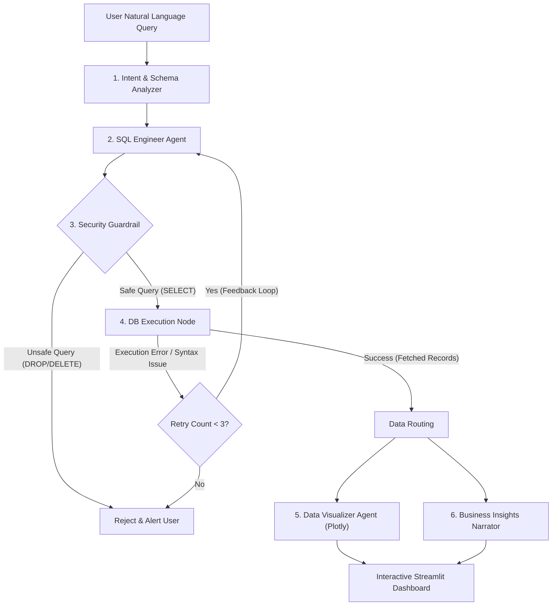

# ⚡ NexusBI: Autonomous Multi-Agent BI & Conversational Analytics Engine

[](https://langchain-ai.github.io/langgraph/)
[](https://console.groq.com)
[](https://streamlit.io)
[-success?style=for-the-badge)](#-100-free-tier-architecture)
[](LICENSE)

> **Turn any raw database or spreadsheet into instant executive insights, validated SQL, interactive Plotly dashboards, and strategic recommendations through conversational Agentic AI.**

---

## 🌟 The Problem & The Solution

| Traditional BI & Data Analytics | NexusBI: Autonomous Multi-Agent BI |
| :--- | :--- |
| ⏳ **Data Bottleneck:** Non-technical executives wait hours or days for data engineering teams to write custom SQL. | ⚡ **Instant Answers:** Ask questions in plain English; get validated queries and insights in under 5 seconds. |
| 📄 **Raw Numbers without Context:** Standard dashboards show static numbers, leaving users guessing "so what?". | 💡 **Executive Synthesis:** Delivers direct answers, key trend breakdowns, and actionable strategic next steps. |
| 💸 **Expensive Enterprise Licenses:** PowerBI, Tableau, and Snowflake cost thousands of dollars per month. | 🆓 **100% Free Stack:** Powered by SQLite, Groq Free Llama 3.3 / Google Gemini, and Streamlit Community Cloud. |
| ❌ **Fragile Execution:** A single column typo breaks scripts and crashes dashboards. | 🔄 **Autonomous Self-Healing:** Agents detect database errors, reason about what went wrong, and self-correct on the fly. |

---

## 🏗️ Multi-Agent Architecture

NexusBI is engineered with **LangGraph** as a cyclic state machine with specialized sub-agents and safety guardrails:



### Specialized Agents & Modules:
1. **Planner & Intent Analyzer:** Parses conversational context and extracts requested metrics, dimensions, and filters.
2. **SQL Engineer Agent:** Generates ANSI SQLite queries based on real-time database schema reflection.
3. **Enterprise Security Guardrail:** Strict regex & AST parser that blocks destructive operations (`DROP`, `DELETE`, `UPDATE`, `ALTER`, `TRUNCATE`).
4. **Self-Healing Execution Node:** If SQLite raises an error (e.g. table name or column typo), the error traceback is routed back to the SQL agent to self-correct up to 3 times.
5. **Data Visualizer (Chartist):** Dynamically inspects returned data dimensions and generates interactive Plotly visualizations (Line charts for trends, Bar charts for comparisons).
6. **Business Insights Narrator:** Transforms raw SQL tabular data into executive summaries and strategic recommendations.

---

## 🚀 Key Features

* **🧠 Live Thought Tracing:** Watch the multi-agent system reason step-by-step through a collapsible status accordion.
* **🛡️ Built-in Security:** Complete protection against SQL injection and data mutations. Strictly read-only `SELECT` queries allowed.
* **📂 Dynamic Data Ingestion ("Bring Your Own Data"):** Preloaded with a 2024 Sales KPI benchmark dataset (`Sales_Agent`), plus instant drag-and-drop ingestion for any custom CSV or Excel file.
* **📅 Smart Temporal Chronology:** Automatically resolves month-name sorting pitfalls into standardized chronological ISO dates (`YYYY-MM-DD`).
* **📊 Multi-Tab Results:** Switch seamlessly between Executive Insights, Interactive Plotly Graphs, Raw Data Tables, and the Executed SQL Inspector.
* **📥 One-Click Export:** Download retrieved datasets as formatted CSV files directly from the browser.

---

## 🛠️ Tech Stack & Zero-Cost Breakdown

| Component | Technology | Cost | Description |
| :--- | :--- | :--- | :--- |
| **Agent Framework** | [LangGraph](https://langchain-ai.github.io/langgraph/) | **₹0 / $0** | Stateful multi-agent graph with self-healing cycles |
| **LLM Provider** | [Groq Cloud](https://console.groq.com) / [Google Gemini](https://aistudio.google.com) | **₹0 / $0** | Ultra-fast inference (Llama 3.3 70B & Gemini 1.5 Flash) |
| **Database** | SQLite3 + Pandas | **₹0 / $0** | Embedded, serverless, file-based relational database |
| **Visualization** | Plotly Express | **₹0 / $0** | Modern, interactive, zoomable charting library |
| **Frontend & Host** | Streamlit Community Cloud | **₹0 / $0** | Instant public deployment connected to GitHub |

---

## 🏢 Production Architecture (Next.js + FastAPI + Firebase)

NexusBI is evolving from the single-file Streamlit demo below into a real multi-user product, while the **agent engine in `core/` stays 100% unchanged** — it's just called from a REST API now instead of a Streamlit script.

```
Next.js (frontend/)  --Firebase ID token-->  FastAPI (backend/)  -->  core/ (unchanged engine)
      |                                            |                        |
Firebase Auth (client SDK)              Firebase Admin SDK (verify)   data_store/<uid>/nexus_bi.db
      |                                            |
      +-------------------> Firestore <------------+  (users, sessions, messages, datasets, audit_logs)
```

* **`backend/`** — FastAPI service. Verifies Firebase ID tokens, isolates each user's data in `data_store/<uid>/nexus_bi.db`, persists chat history + datasets in Firestore, enforces daily query quotas, writes a security audit log of every SQL query + guardrail verdict, and exposes admin-only analytics endpoints.
* **`frontend/`** — Next.js (TypeScript, App Router, Tailwind) app: Firebase email/Google sign-in, a chat UI with feature parity to the Streamlit app (thought trace, insights/chart/raw-data/SQL tabs, CSV export), and an `/admin` portal (usage overview, user management, audit log).
* **`app.py`** (Streamlit) is kept as-is as a legacy fallback during the transition.

### Setup

1. Create a Firebase project at [console.firebase.google.com](https://console.firebase.google.com): enable **Authentication** (Email/Password + Google) and **Firestore** (Native mode).
2. Generate a service account key (Project Settings → Service Accounts) and point the backend at it:
   ```ini
   # backend/.env (or repo-root .env)
   FIREBASE_SERVICE_ACCOUNT_PATH=/path/to/serviceAccountKey.json
   GROQ_API_KEY=gsk_...            # server-managed LLM key (product no longer asks users for one)
   ```
3. Copy the Firebase **web app config** into `frontend/.env.local` (see `frontend/.env.local.example`).
4. Install & run the backend:
   ```bash
   pip install -r requirements.txt -r requirements-backend.txt
   uvicorn backend.main:app --reload
   ```
5. Install & run the frontend:
   ```bash
   cd frontend
   npm install
   npm run dev
   ```
6. Sign up a user through the app, then manually flip that user's `role` field to `"admin"` in the Firestore `users/{uid}` document to unlock `/admin`.

Run `python -m unittest backend.tests.test_chat` for the backend's API-layer tests (auth, quota, guardrail-block auditing, admin gating, per-user data isolation, Cloud Storage durability), and `python -m unittest discover -s tests` for the original engine tests — both stay green independently, proving the agent workflow itself was never touched.

### Deploying: backend on Render, frontend on Vercel

Per-user datasets live at `data_store/<uid>/nexus_bi.db` on local disk, which most hosts (Render included) don't guarantee survives a redeploy or restart. To make that durable, each user's SQLite file is also synced to a **Firebase Cloud Storage** bucket (`backend/storage_client.py`) — downloaded to local disk on first access if missing, re-uploaded after any dataset upload/delete. This is a durability layer *underneath* SQLite, not a replacement for it: `core/database.py` still owns all SQL logic and has no idea Cloud Storage exists.

**Backend → Render**

1. In the Firebase Console, enable **Storage** if you haven't already, and copy the bucket name (Project Settings → General → Your apps, or the Storage page) — it's the same value as `frontend/.env.local`'s `NEXT_PUBLIC_FIREBASE_STORAGE_BUCKET`.
2. Push this repo to GitHub, then create a new **Blueprint** on [render.com](https://render.com) pointing at it — it picks up `render.yaml` automatically.
3. In the Render dashboard, fill in the env vars marked `sync: false` in `render.yaml`:
   - `GROQ_API_KEY`
   - `FIREBASE_SERVICE_ACCOUNT_JSON` — paste the **entire contents** of your service account JSON file as one value (not `FIREBASE_SERVICE_ACCOUNT_PATH`: Render's disk is ephemeral, so a file written at build time won't reliably be there later)
   - `FIREBASE_STORAGE_BUCKET`
   - `CORS_ORIGINS` — set this once you have your Vercel URL (step below), e.g. `https://your-app.vercel.app`
4. Deploy. Note the resulting Render URL (e.g. `https://nexusbi-backend.onrender.com`).

**Frontend → Vercel**

1. Import the repo on [vercel.com](https://vercel.com), setting the project root to `frontend/` (Next.js is auto-detected).
2. Add the same six `NEXT_PUBLIC_FIREBASE_*` env vars as your local `frontend/.env.local`, plus `NEXT_PUBLIC_API_BASE_URL` set to your Render backend's URL from above.
3. Deploy, then go back to Render and set `CORS_ORIGINS` to the Vercel URL you were just given, and redeploy the backend.
4. **Required manual step** — in the Firebase Console, go to Authentication → Settings → **Authorized domains** and add your Vercel domain. Without this, sign-in fails on the deployed site even though it works locally.

---

## 💻 Local Setup & Quickstart (Legacy Streamlit App)

### 1. Clone the Repository
```bash
git clone https://github.com/your-username/nexus-bi.git
cd nexus-bi
```

### 2. Create and Activate a Virtual Environment
```bash
python -m venv venv
# On Windows:
venv\Scripts\activate
# On macOS/Linux:
source venv/bin/activate
```

### 3. Install Dependencies
```bash
pip install -r requirements.txt
```

### 4. (Optional) Set up Environment Variables
Create a `.env` file from `.env.example`:
```bash
cp .env.example .env
```
Add your free API key (either Groq or Gemini):
```ini
GROQ_API_KEY=gsk_...
# OR
GEMINI_API_KEY=AIzaSy...
```
*(Note: You can also enter your API key directly inside the Streamlit web interface without creating a `.env` file!)*

### 5. Launch the Application
```bash
streamlit run app.py
```
Open [http://localhost:8501](http://localhost:8501) in your browser.

---

## 🌐 1-Click Free Deployment to Streamlit Cloud

To deploy this project live for free:
1. **Push your code to GitHub:**
   ```bash
   git init
   git add .
   git commit -m "Initial release of NexusBI"
   git remote add origin https://github.com/<your-username>/<your-repo-name>.git
   git push -u origin main
   ```
2. Go to **[share.streamlit.io](https://share.streamlit.io/)** and sign in with your GitHub account.
3. Click **"New App"** and select your repository.
4. Set Main file path to: `app.py`.
5. Under **Advanced Settings $\to$ Secrets**, optionally add:
   ```toml
   GROQ_API_KEY = "your-groq-key"
   ```
6. Click **Deploy!** Your app will be live with a public URL in 2 minutes.

---

## 📁 Project Structure

```
nexus-bi/
│
├── .env.example                 # Template for API keys
├── .gitignore                   # Excludes secret keys, caches, and DBs
├── README.md                    # Project documentation & Hackathon presentation
├── requirements.txt             # Pinned, conflict-free Python dependencies
├── IMPLEMENTATION_PLAN.md       # Technical architecture specification
├── memory.md                    # Conversation history & decision log
│
├── data/
│   └── Sales_Agent.csv          # Preloaded 2024 Sales KPI benchmark dataset
│
├── core/
│   ├── __init__.py              # Engine package initializer
│   ├── models.py                # Pydantic models & LangGraph AgentState
│   ├── database.py              # SQLite connection, dynamic CSV ingestion, schema extraction
│   ├── security.py              # SQL Guardrail validator (Read-Only AST/Regex verification)
│   ├── llm_factory.py           # Unified Free LLM provider router (Groq / Gemini)
│   └── agent_graph.py           # LangGraph StateGraph (Nodes, Edges, Self-Healing)
│
└── app.py                       # Streamlit UI with Thought Tracing, Tabbed Results & Plotly
```

---

## 🛡️ Security & Responsible AI

* **Read-Only Enforced:** Queries are validated before reaching the database. Data mutation commands (`DELETE`, `DROP`, `UPDATE`) trigger an immediate security stop.
* **Transient Session Keys:** User API keys provided in the UI sidebar exist only in memory during the browser session and are never written to disk or logs.
* **Safe Sandboxed Execution:** Dynamic Plotly chart code runs within an isolated local scope with restricted globals.

---

## 📜 License
This project is licensed under the MIT License — see the [LICENSE](LICENSE) file for details.
